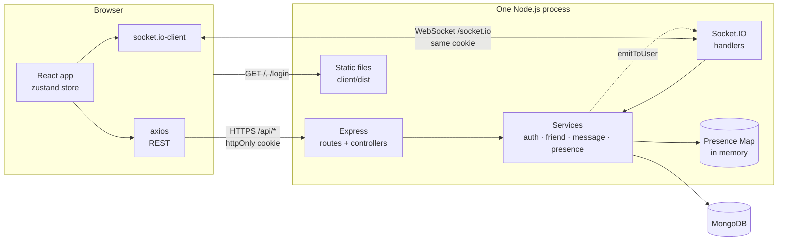
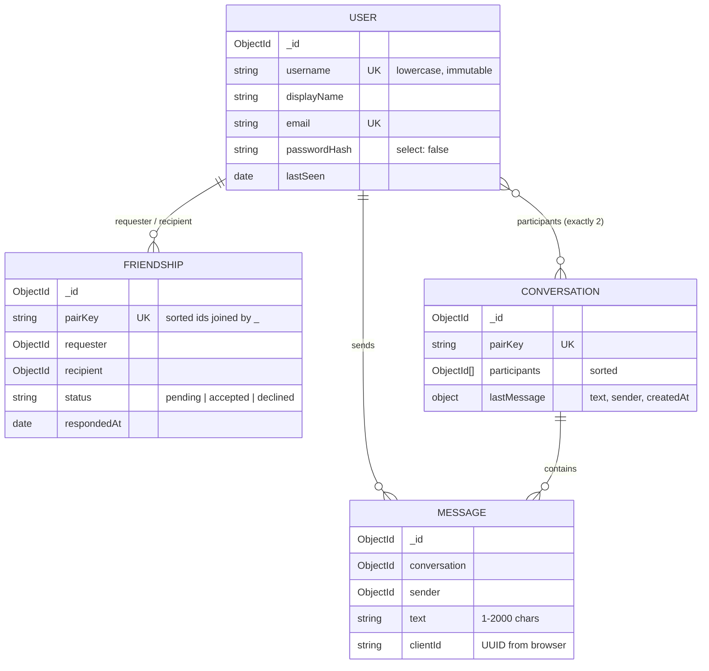
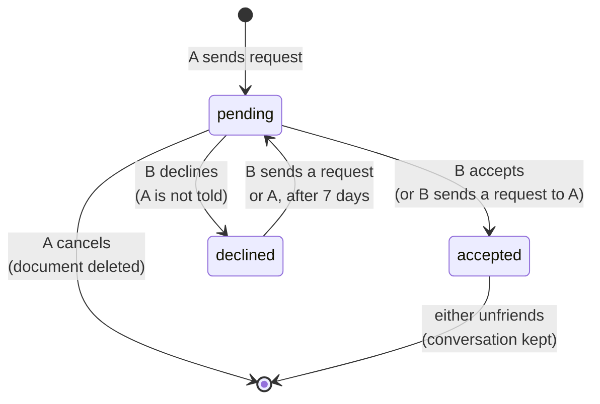
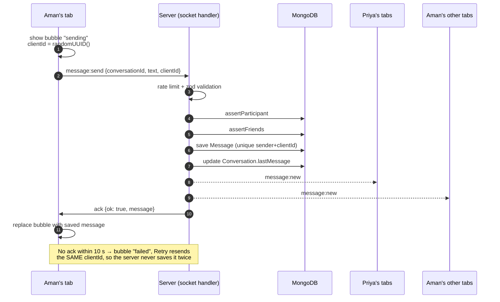
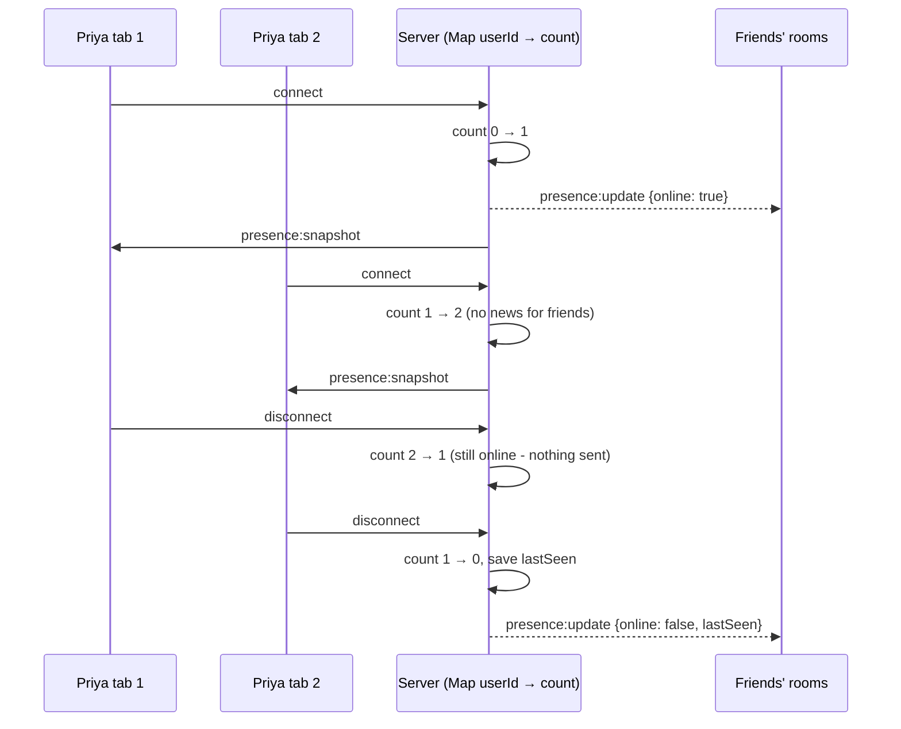

# Diagrams

Mermaid diagrams for the project report. GitHub and VS Code (with a Mermaid
extension) render them directly; for the report, paste each block into
<https://mermaid.live> and export as PNG or SVG.

---

## 1. System architecture



REST is for data that is **fetched**; Socket.IO is for things that
**happen**. Both call the same services, and MongoDB is the single source of
truth.

---

## 2. Data model



Unique indexes that enforce rules at database level:
`User.username`, `User.email`, `Friendship.pairKey`, `Conversation.pairKey`,
`Message.(sender, clientId)`.

---

## 3. Friendship lifecycle



There is only ever **one** Friendship document per pair (unique `pairKey`), so
duplicate or crossed requests are impossible.

---

## 4. Sending a message



If any step before the save fails, nothing is emitted and the ack is
`{ ok: false, error }`, so a message never appears on screen without being
stored.

---

## 5. Presence (why we count connections)



---

## 6. Authentication

```mermaid
sequenceDiagram
    participant B as Browser
    participant E as Express
    participant DB as MongoDB

    B->>E: POST /api/auth/login {identifier, password}
    E->>DB: find user by username OR email (+passwordHash)
    E->>E: bcrypt.compare (dummy hash if user not found)
    E-->>B: 200 {user} + Set-Cookie: token=JWT<br/>HttpOnly; SameSite=Lax; Secure
    Note over B: JavaScript cannot read the cookie
    B->>E: GET /api/friends (cookie sent automatically)
    E->>E: requireAuth: verify JWT, load user
    E-->>B: 200 {friends}
    B->>E: Socket.IO handshake (same cookie)
    E->>E: socketAuth: parse cookie, verify JWT
```
